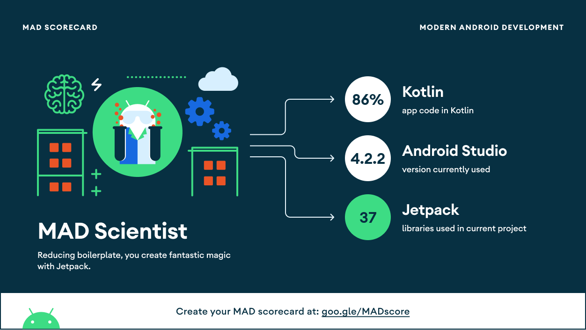
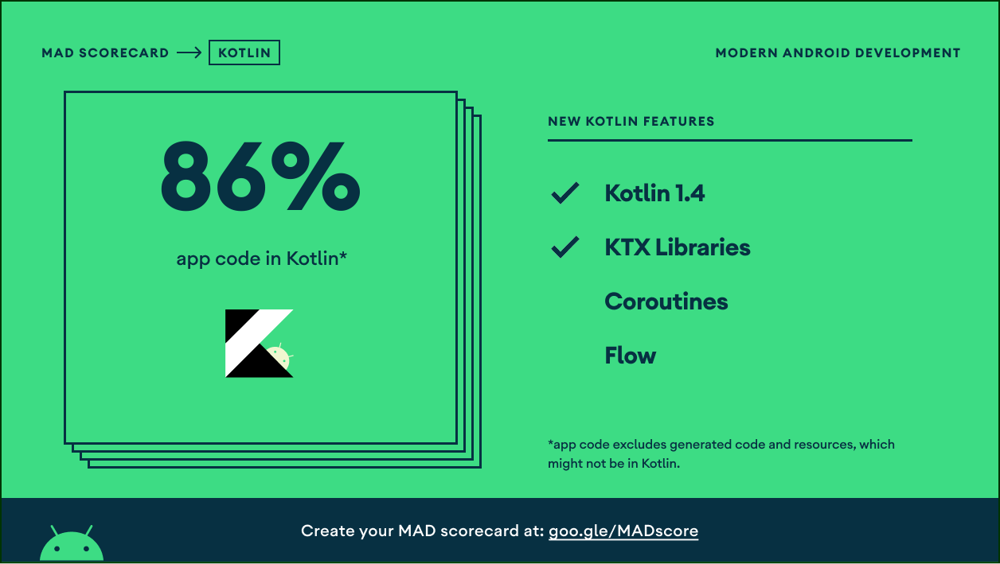
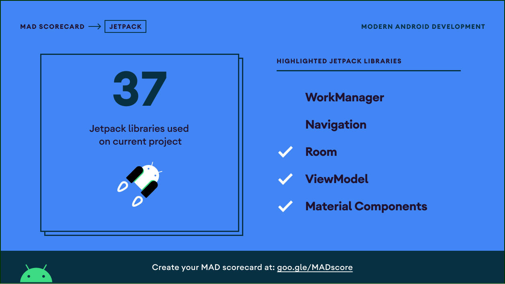

# GITHUB-USERS
[](http://developer.android.com/index.html) [](http://kotlinlang.org) [](https://developer.android.com/studio/releases/gradle-plugin)

# Table Of Contents
- [Introduction](#introduction)
- [Usage](#usage)
- [Demo](#demo)
- [Tech Stack](#tech-stack)
- [Mad Scoreboard](#mad-scoreboard)

## Introduction

An application to show GitHub Users

## Usage

```
===== REPLACE YOUR_GITHUB_TOKEN AS YOUR GITHUB TOKEN =====
buildConfigField "String", "API_TOKEN", "\"YOUR_GITHUB_TOKEN\""
location: build.gradle (Module: App)
==========================================================
```

## Demo

|Splash|User List (Home)|Detail User|Favorite|
|--|--|--|--|
||||

## Tech Stack

- [Kotlin](https://kotlinlang.org/) - First class and official programming language for Android development.
- [Retrofit](https://square.github.io/retrofit/) - A type-safe HTTP client for Android and Java.
- [OkHttp](http://square.github.io/okhttp/) An HTTP & HTTP/2 client for Android and Java applications.
- [Gson](https://github.com/google/gson) A Java serialization/deserialization library to convert Java Objects into JSON and back
- [Glide](https://github.com/bumptech/glide) An image loading and caching library for Android focused on smooth scrolling
- [Material Design](https://material.io/develop/android/docs/getting-started) Material is a design system created by Google to help teams build high-quality digital experiences for Android, iOS, Flutter, and the web.

## Mad Scoreboard

<p align="center">
    
</p>

<p align="center">
    
</p>

<p align="center">
    
</p>

## License
```

   Copyright © 2021 Fadhlan Hadaina

   Licensed under the Apache License, Version 2.0 (the "License");
   you may not use this file except in compliance with the License.
   You may obtain a copy of the License at

       http://www.apache.org/licenses/LICENSE-2.0

   Unless required by applicable law or agreed to in writing, software
   distributed under the License is distributed on an "AS IS" BASIS,
   WITHOUT WARRANTIES OR CONDITIONS OF ANY KIND, either express or implied.
   See the License for the specific language governing permissions and
   limitations under the License.

```


